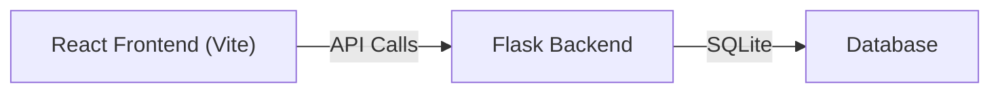

# Daily Counter Tracker — NamJap

A web application to track daily counts, log them, and view totals/history over time.

## Architecture

| Layer | Tech | Details |
|-------|------|---------|
| **Frontend** | React + Vite (Node) | Modern SPA with beautiful dark UI |
| **Backend** | Flask (Python) | REST API for CRUD operations |
| **Database** | SQLite | Lightweight, no setup needed |

## Features

### Core
- **Daily Counter** — Increment/decrement counter with a big button, log it for the day
- **Today's View** — See current day's count prominently
- **Log History** — Table/calendar view of all past daily logs with dates and counts
- **Running Total** — Cumulative total across all logged days
- **Edit/Delete** — Modify or remove past entries

### UI/UX
- Premium dark theme with glassmorphism and gradients
- Smooth animations on counter changes
- Responsive layout (mobile-friendly)
- Stats dashboard (streak, average, max day, total)

## Proposed Changes

### Backend — Flask API

#### [NEW] [app.py](file:///x:/OngoingProject/NamJap/backend/app.py)
- Flask application with REST endpoints
- Endpoints:
  - `GET /api/today` — Get today's log entry
  - `POST /api/log` — Create/update today's count
  - `GET /api/logs` — Get all log entries (with optional date range filter)
  - `GET /api/stats` — Get aggregate stats (total, average, streak, max)
  - `PUT /api/log/<id>` — Edit a past entry
  - `DELETE /api/log/<id>` — Delete an entry
- CORS enabled for frontend dev server

#### [NEW] [models.py](file:///x:/OngoingProject/NamJap/backend/models.py)
- SQLAlchemy model for `DailyLog`:
  - `id` (Integer, PK)
  - `date` (Date, unique)
  - `count` (Integer)
  - `notes` (String, optional)
  - `created_at` (DateTime)
  - `updated_at` (DateTime)

#### [NEW] [requirements.txt](file:///x:/OngoingProject/NamJap/backend/requirements.txt)
- Flask, Flask-CORS, Flask-SQLAlchemy

---

### Frontend — React (Vite)

#### [NEW] [src/App.jsx](file:///x:/OngoingProject/NamJap/frontend/src/App.jsx)
- Main app component with routing between Counter and History views

#### [NEW] [src/components/Counter.jsx](file:///x:/OngoingProject/NamJap/frontend/src/components/Counter.jsx)
- Big animated counter display
- +1 / -1 / custom increment buttons
- "Save Today's Log" button
- Shows today's date and current count

#### [NEW] [src/components/Stats.jsx](file:///x:/OngoingProject/NamJap/frontend/src/components/Stats.jsx)
- Dashboard cards: Total Count, Today's Count, Daily Average, Best Day, Current Streak

#### [NEW] [src/components/History.jsx](file:///x:/OngoingProject/NamJap/frontend/src/components/History.jsx)
- Scrollable table of all daily logs (date, count, notes)
- Edit and delete actions per row

#### [NEW] [src/index.css](file:///x:/OngoingProject/NamJap/frontend/src/index.css)
- Dark theme design system with CSS variables
- Glassmorphism cards, gradients, animations

---

### Project Root

#### [NEW] [README.md](file:///x:/OngoingProject/NamJap/README.md)
- Setup instructions for both frontend and backend

## Open Questions

> [!IMPORTANT]
> **What are you counting?** — This helps me pick the right label/icon (e.g., "Nam Jap Count", "Prayers", "Mantras", "Habits"). I'll default to a generic "Daily Count" if you don't specify.

> [!NOTE]
> **Notes field** — Should each daily log have an optional notes/comment field, or just the count?

## Verification Plan

### Automated
- Start Flask backend: `python app.py` — verify API returns JSON
- Start Vite frontend: `npm run dev` — verify UI renders

### Manual
- Increment counter → save → verify it appears in history
- Refresh page → verify today's count persists
- Check stats dashboard shows correct totals
